# h1 - Oma Linux

## Raportin kirjoittaminen - tiivistelmä

- Raportoinnissa kerrotaan vaiheet ja teot täsmällisesti, sekä niiden tulokset (myös virheilmoitukset)
- Mitä yksityiskohtaisempi raportti, sitä helpompi vaiheiden tuloksia ja virhetilanteita on toistaa
- Hyvä kirjoitusasu ja kieli tärkeää luettavuuden ja ymmärrettävyyden kannalta
- Lähteisiin viitataan
- Ajatuksia helpompi jäsennellä

## Linuxin asennus

Harjoituksen tavoitteena oli asentaa oma Linux virtuaalikoneeseen.

## Linuxin asennus - alustus

Tein tämän harjoituksen sunnuntaina 24.8.2025 kotonani Espoon Karakalliossa. Käytin harjoituksessa koulukannettavaani, Lenovo IdeaPad 3 15ITL6. Käyttöjärjestelmänä Windows 11.

16:30 aloitin tehtävän tekemisen.

Käytin asennuksen virtuaalikoneena Oraclen VM Virtualboxia, jota olin käyttänyt jo johdantokurssilla.
16:45 aloitin virtuaalikoneen asennuksen alustuksen. Valitsin ISO Image-kohdassa Debianin levynkuvan (versio 13.0.0-amd64-xfce.iso), joka asetti latauksen tyypiksi Linuxin, ja Debianin 64-bittisen version.

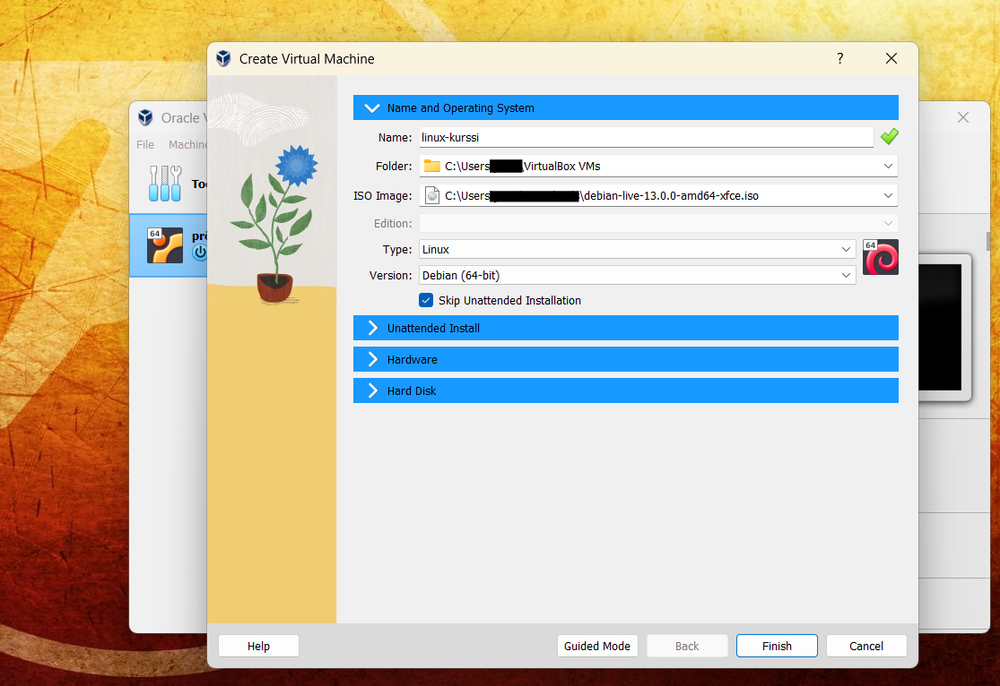

Asennuksen Hardware-kohdassa laitoin Base Memory -kohtaan 4096Mb ja prosessorien määräksi 2. Sallin myös EFI:n käytön. 

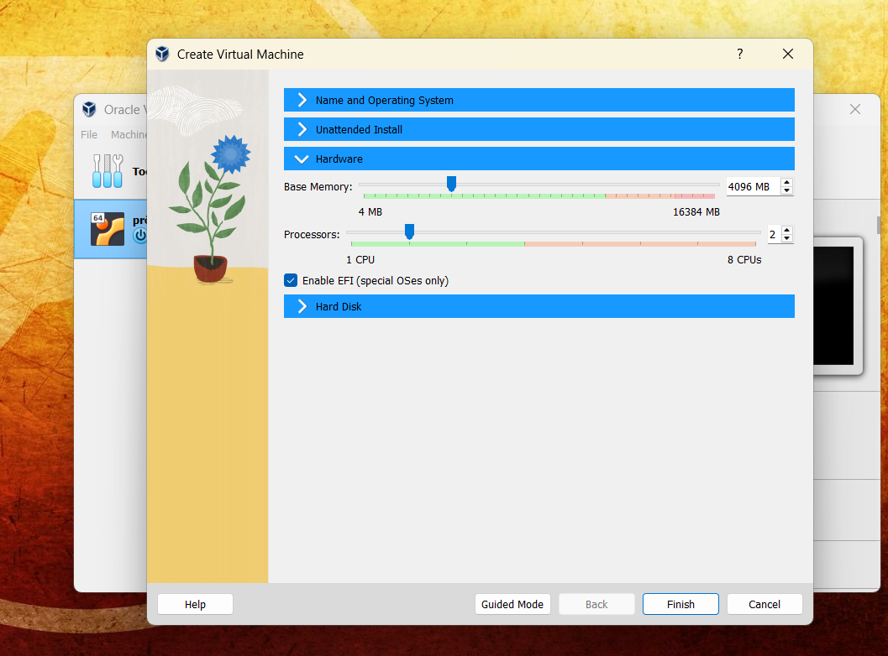

Hard Disk -asetuksista asetin kovalevyn hakemiston sijainnin ja määrittelin sen kooksi 20 gigatavua.

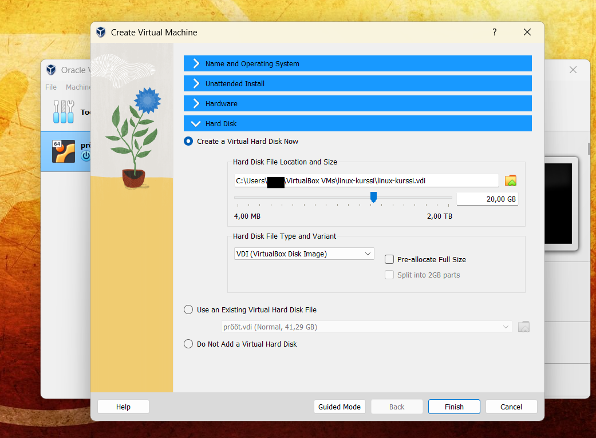

17:15 sain alustuksen valmiiksi ja virtuaalikoneen valmiiksi, jonka jälkeen käynnistin sen (kursorilla right click virtuaalikoneen kohdalla -> Start -> Normal Start). Käynnistyksen jälkeen pääsin Boot Live Menuun,
josta valitsin Live System -vaihtoehdon virtuaalikoneen toimivuuden testaamista varten. 

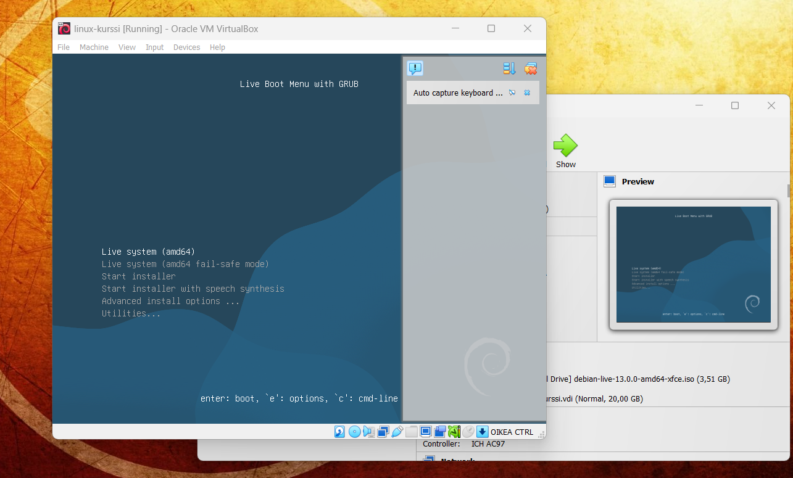

## Linuxin asennus - virtuaalikoneen testaus

17:25 pääsin testaamaan virtuaalikoneen toimivuutta. Avasin ensimmäiseksi Firefox-selaimen ja varmistin, että internet toimii ja on ajan tasalla. 
17:29 Kävin Ylen sivuilla katsomassa tuoreimmat uutiset ja viimeisin uutinen oli ajalta 17:28.

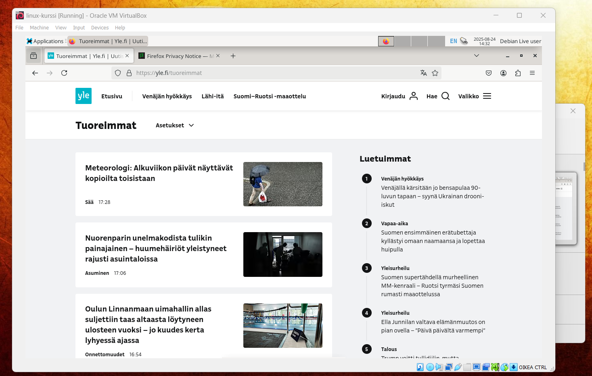

17:35 avasin komentokentän, ja yritin kirjoittaa peruskomentoja syötteeseen. Tässä kohtaa tuli pieniä mutkia matkaan, kun virtaalikone otti näppäimistön syötteet englanninkielisestä näppäimistöstä. 
Löysin Baeldong.comista ratkaisuksi (ja muistelen tunnillakin tästä mainittaneen) "setxkbmap" komennon, jonka avulla pystyin laittamaan näppäimistön kielen suomeksi ("setxkbmap fi").
Kokeilin sen jälkeen erilaisia perussyötteitä, jotka toimivat odotetusti.

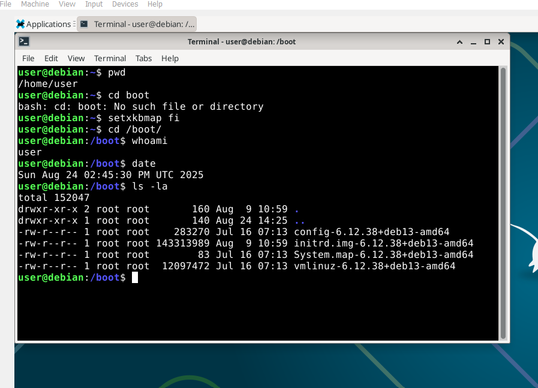

## Linuxin asennus - virtuaalikoneen viimeistely

17:52 kirjoitin komentosyötteeseen "sudo reboot", mikä palautti minut Live Boot -valikkoon.
Tällä kertaa painoin Start Installer -vaihtoehtoa, joka vei minut määrittelemään viimeisiä asetuksia. 
Asetuksissa pääsin valitsemaan: 
 - kielen (valinta: english)
 - sijainnin (Finland)
 - localen (en-US.UTF-8)
 - näppäimistön kielen (Finnish)
 - näppäimen kielen vaihtoon (Alt + Shift)
 - nimen (hostname: linux-kurssi)

Tämän jälkeen asetin itselleni käyttäjän omalla nimelläni ja asetin sille salasanan. 

18:15 Määrittelin Partition disks -asetukset. 
Valitsin asetuksista: 
  - Guided - use entire disk
  - ainut vaihtoehto käytettävistä levyistä (ATA VBOX HARDDISK)
  - All files in one partition

Kuvassa yleiskuva osioista (Partitions): 

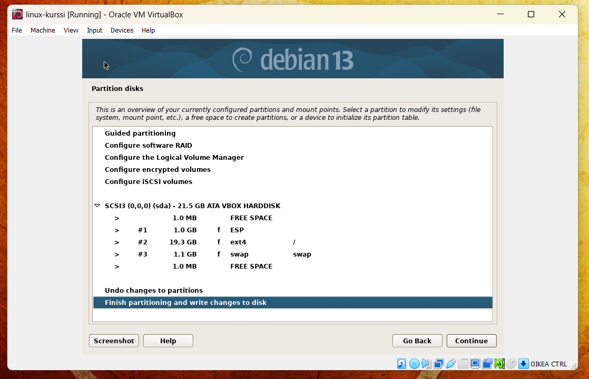

18:28 sain viimeistelyt valmiiksi ja aloitin palvelimen asennuksen. 
18:40 asennus valmistui, jonka jälkeen painoin Continue, joka käynnisti palvelimen uudelleen.

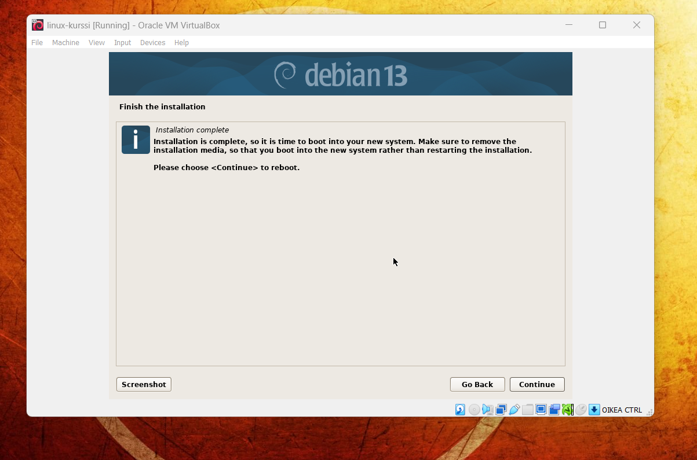

## Linuxin asennus - käyttöönotto

18:42 Kirjauduin sisään Linuxiin käyttäjätunnuksilla, jotka olin luonut alustuksen viimeistelyssä.
18:45 Avasin komentorivin ja yritin päivittää systeemin pakettitarjontaa "apt-get update" komennolla, mutta sain virheilmoituksena "13 :Permission Denied"

Käytin tämän korjaamiseen Johanna Heinosen metodia, jossa lisään tarvittavat tiedot sources.list tiedostoon. 
Tässä tuli ongelma tekstin kopioimisesta ja liittämisestä omalta koneelta virtuaalikoneelle. 

Yritin muuttaa Virtualboxin asetuksista niin, että leikepöytä olisi jaettu virtuaalikoneen ja oman koneeni välillä, mutta kopioitu teksti ei yksinkertaisesti liittynyt virtuaalikoneelle. 
Lopulta ratkaisin tämän yksinkertaisesti avaamalla tarvittavan sivun itse linuxilla, mitä kautta sain kopioitua ja liitettyä tarvittavan tekstin komentoriville. 

19:25 Tuli uusi ongelma, kun yritin echo-metodin avulla lisätä kopioidun tekstin sources.list tiedostoon: 

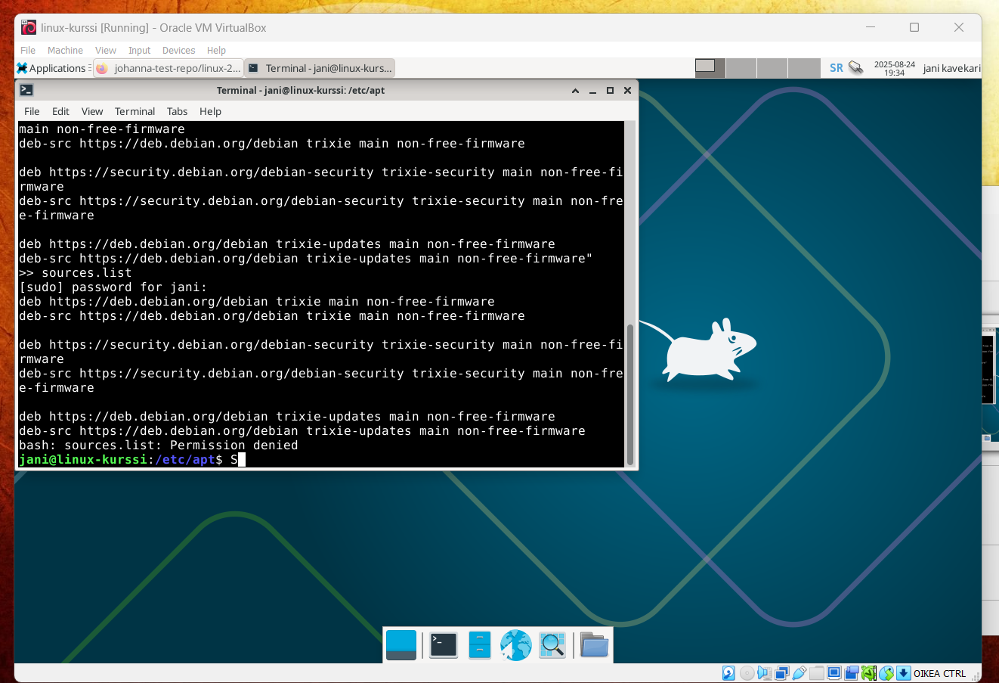

Ratkaisin tämän tekemällä uuden tiedosten sources.list.d -hakemistoon, jonne liittää kopioitu teksti. 
Tein tämän komennolla "sudo touch [tiedoston nimi]", jonka jälkeen kirjoitin komennon echo "[kopioitava teksti]" | sudo tee -a [tiedoston_nimi].
Tämän jälkeen "sudo apt-get update" näytti toimivan paremmin. 

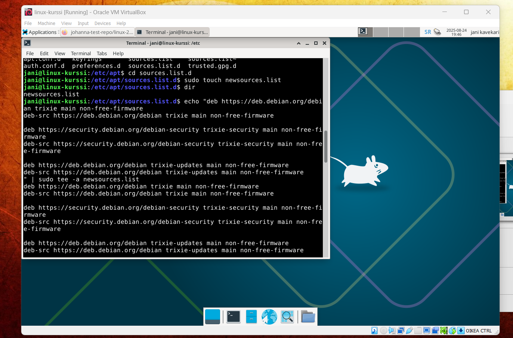

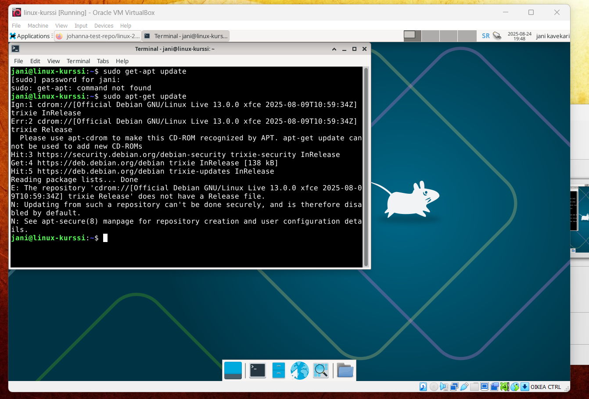

Tämä ratkaisu oli valmis n. 19:50.

### Lähteet

Käytin tämän harjoituksen tekemiseen ja tiedonhankintaan seuraavia lähteitä: 

- Ask Ubuntu 2012: permission denied: /etc/apt/sources.list [duplicate]. Foorumikeskustelu. https://askubuntu.com/questions/185268/permission-denied-etc-apt-sources-list
- Baeldung.com 2025-04-09: Change Keyboard Layout in the Linux Console. Internet-artikkeli. https://www.baeldung.com/linux/console-change-keyboard-layout
- Bizanosa.com 2023-01-19: Linux commands to add or change the content of a file. Internet-artikkeli. https://bizanosa.com/linux-commands-edit-content-of-a-file/
- Debian Wiki: SourcesList. https://wiki.debian.org/SourcesList#sources.list_format
- Github Docs 2025: Basic writing and formatting syntax. https://docs.github.com/en/get-started/writing-on-github/getting-started-with-writing-and-formatting-on-github/basic-writing-and-formatting-syntax
- Heinonen, Johanna 2025-08-20: How to Install Linux to Virtualbox? Github-repositorio. https://github.com/johannaheinonen/johanna-test-repo/blob/main/linux-20082025.md
- Karvinen, Tero 2025-08-20: Oppitunti, Linux-palvelimet-kurssi, Haaga-Helia. https://terokarvinen.com/linux-palvelimet/#h1-oma-linux
- Karvinen, Tero 2025 2023-04-11: Adding images to MarkDown. Github-repositorio. https://github.com/terokarvinen/dreamhugmonkey#adding-images-to-markdown
  
