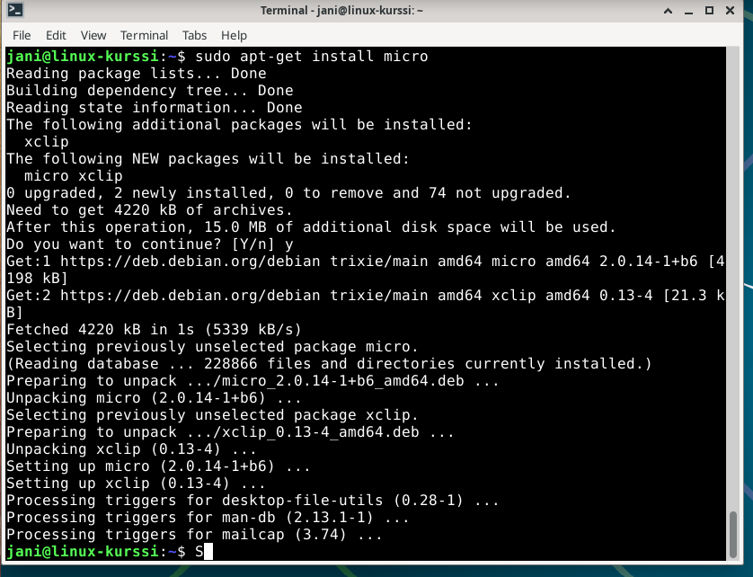
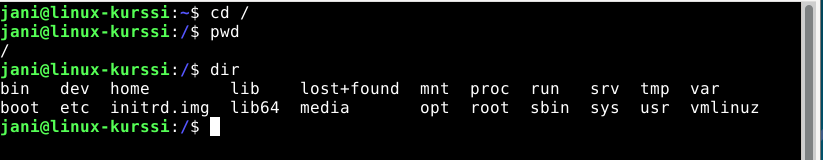
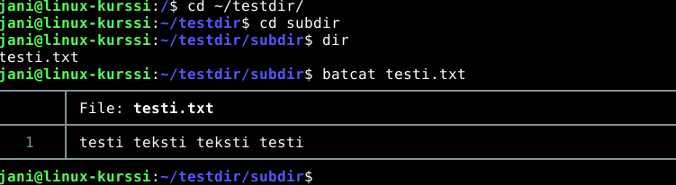
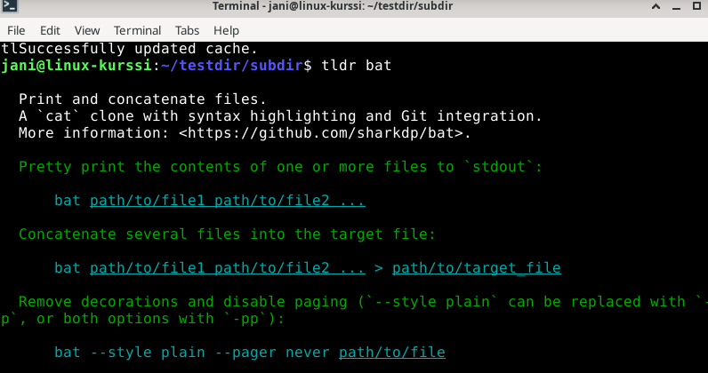
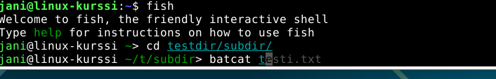
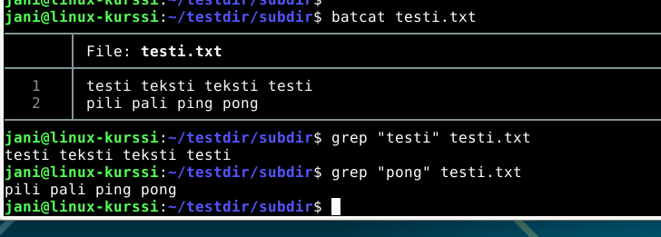
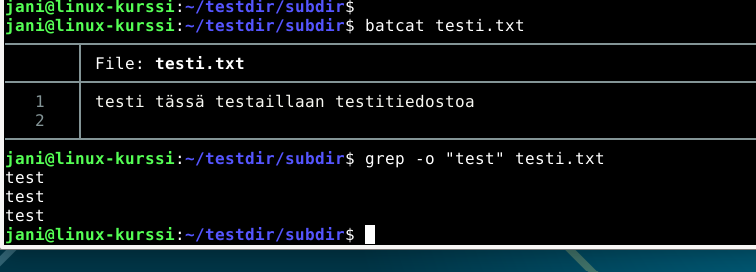
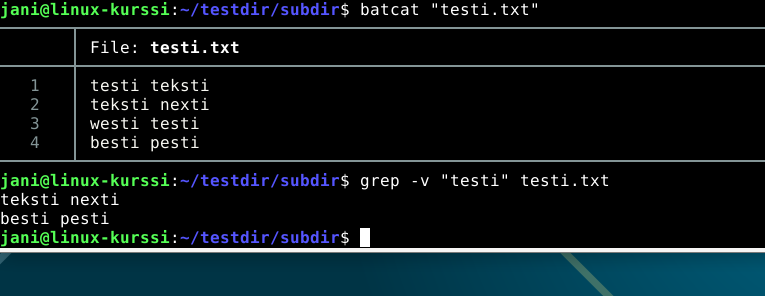
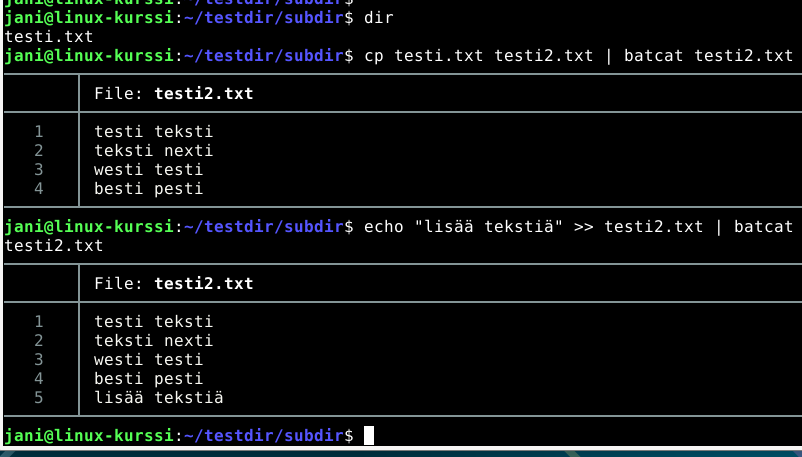
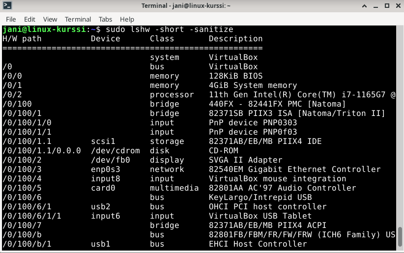

# h2 - Komentaja Pingviini

**28.8.2025**

## Command Line Basics Revisited - tiivistelmä

- Linuxissa komentoriviä käytetään kaikkeen, aina navigoinnista tiedostojen ja pakettien hallinnointiin.
- Tiedostoja voi muokata tekstieditoreilla, kuten pico ja nano.
- Kun komentorivillä poistetaan jotain, se on lopullisesti menetetty eikä toimintoa pysty jälkeenpäin peruuttamaan.
- Komentoriviltä voi myös kysyä tietoa ja ohjeita eri komentoihin liittyen (esim. man ja --help komennoilla).
- Root ("/") on nimensä mukaisesti systeemin juuressa ja järjestelmän ylin hakemisto. 
- Sudo-komento antaa käyttäjälle oikeudet suorittaa tärkeämpiä toimintoja, joita ei peruskäyttäjänä pysty suorittamaan.

## Harjoitus - Komentokehote, ylläpito ja paketinhallinta

**21:25** käynnistin Linuxin ja avasin komentorivin. Kokeilin aluksi joitain Tero Karvisen ohjeessa olleita komentoja, joita en vielä ollut keskiviikon tunnilla kokeillut (man, more ja less -komennot).

### Micro-editorin lataus

#### Säätämistä 

**21:30** Micro-editorin lataus komentorivin kautta meni heti puihin, kun en voinut käyttää sudo-oikeuksia editorin lataamista varten. 
Kun komentorivi pyysi salasanaani, ei se hyväksynyt sitä oikeana, vaikka varmistin myöhemmin kirjoittavani sen täysin oikein.
Yritin virtuaalikoneen uudelleenkäynnistystä ja uutta sisäänkirjautumista, mutta tästä huolimatta ongelma pysyi täysin samana. 
Etsin tähän vastausta noin 30 minuuttia, kunnes päätin sulkea Linuxin ja kokeilla hieman myöhemmin uudelleen. 

**22:45** jatkoin ongelman selvittämistä ja otin ChatGPT:n mukaan tarjoamaan vaihtoehtoja, kun googlaamalla löydetyt vaihtoehdot eivät auttaneet. 
Lopulta ongelma oli täysin naurettava ja kiinni virheellisestä näppäimistön kielivalinnasta, minkä korjasin vasta eilisen etäluennon (27.08.2025) lopussa: 
Olin virheellisesti asettanut Linuxin asennuksessa näppäimistön kieleksi Serbian, jolla on nähtävästi varsin erilainen näppäimistö käytettävissä - sentään oli latinalaiset aakkoset käytössä.
Tämä ilmeisesti johti siihen, että kun olin aiemmin käyttänyt sudo-oikeuksia ja kirjoittanut siinä salasanan, oli komentorivi ottanut sen serbialaisen näppäimistön syötteellä, joka taas teki komentoriville syötettävästä salasanasta eri salasanan. Korjattuani näppäimistön suomalaiseksi, ei sisäänkirjautuminen enään onnistunut, kun syöte oli täysin eri. 

Noin **23:20** sain jotain tolkkua touhuun, kun latasin virtuaalikoneen Preferences-kohdasta itselleni serbialaisen näppäimistön takaisin. Vähemmän yllättäen salasana toimi, kun sen kirjoitti komentoriville serbialaisella näppäimistöllä.

Tämän korjasin sitten simppelisti komentorivin passwd-komennolla, jossa kirjoitin alkuperäisen salasanan serbiankielisellä näppiksellä ja uuden suomalaisella. 

**23:30** Ongelmat jatkui, kun raportin päivittämisen jälkeen en pääsekään kirjautumaan takaisin Linuxiin... koska se ei hyväksy salasanaa. Tässä kohtaa totesin säätämisen liian turhauttavaksi ja vaivaalloiseksi, ja päätin aloittaa vaan koko homman alusta - uusi Linux asennukseen. 

**0:25** sain uuden Linuxin pyörimään ja avasin komentorivin uudelleen.
**0:35** olin taas alkupisteessä.

#### Micron asennus

**0:40** latasin micro-editorin komennolla 

        sudo apt-get install micro

Kuvassa latauksen tulos: 

### FHS - Tärkeät hakemistot

- **/** on järjestelmän juurihakemisto, sisältäen kaikki muut alihakemistot.

        cd /
        

- **/home/** sisältää kyseisen Linuxin käyttäjien omat kansiot. 

        cd /home/
        
- **/home/(käyttäjä)** on kansio, johon Linuxin käyttäjä voi luoda ja tallettaa tietoa. 
Esim.

        cd /home/jani/
        cd

- **/etc/** sisältää järjestelmänlaajuiset asetukset. 
Esim.

        cd /etc/apt/
        cd /etc/ssh/

- **/media/** sisältää mahdolliset ulkoiset muistilähteet, esim. CD-rom tai ulkoinen kovalevy. 
Esim.

        cd /media/cdrom/

- **/var/log/** sisältää järjestelmänlaajuiset lokit. 
Esim. 
        cd /var/log/apt/

### Apt - komentoriviohjelmien asennus

**29.8.2025**

16:30 rupesin googlailemaan ja etsimään apt-cache search komennolla komentoriviohjelmia. Löysin pienen etsiskelyn jälkeen seuraavat ohjelmat, jotka päätin asentaa: 

- **bat** - cat-komennon klooni, joka korostaa syntaxin ja sisältää git integraation.
- **tealdeer** (tldr) - tiivistää man-komennon manuaalit olennaisimpiin kohtiin.
- **fish** - aloittelijaystävällinen komentorivi

N. 17:00 latasin nämä ohjelmat komennolla 

                                sudo apt-get install bat tealdeer fish

17:05 varmistin, että jokainen ohjelma oli latautunut.
Aluksi en meinannut saada bat-komentoa toimimaan, mutta googlailulla selvisi, että "bat" sijaan pitikin käyttää komentoa "batcat".

**bat**

**tldr**

**fish**

### Grep-komento

**17:30** kokeilin tldr-komentoa katsomalla ohjelman tiivistelmän **grep**-komennosta. 
**17:35** siirryin luomaani testikansioon kokeilemaan grepin toimintaa testitiedoston kanssa: 

**Perinteinen grep-komento**

*grep*

**Grep-komento, joka tulostaa vain etsityn patternin esiintymiskerrat**

*grep -o*

**Grep-komento, joka jättää tulostamatta rivit, jotka sisältävät patternin**

*grep -v*

### Pipe

**18:05** rupesin tarkemmin selvittämään putken(pipe, "|") toimintaa ja käyttötarkoitusta.
**18:30** tein yksinkertaisen esimerkin putken käytöstä, jossa kopioin testitiedoston sisällön uuteen tiedostoon, ja tulostan sen samantien bat-komennolla, mikä näyttää minulle tiedoston. Tämän jälkeen lisään echo-komennolla uutta tekstiä uuden tiedoston loppuun, ja näytän taas lopputuloksen bat-komennon avulla: 

Pääsin siis heti näkemään tekstitiedoston muutosten jälkeen ja varmistamaan, että ne olivat halutunlaiset. 

### Rauta 

**18:45** yritin tehtävänannon mukaan listata koneen raudan komennolla:

                                sudo lshw -short -sanitize

Aluksi tämä ei mennyt läpi, koska lshw piti erikseen ladata. Latauksen jälkeen komento näytti yhteenvedon, joka sisälsi tietoa koneen raudasta ja sen osista, sekä niiden luokituksen ja kuvauksen. Selvitin myös -short ja -sanitize-vaihtoehtojen tarkoitukset:
- **short**: listaus näyttää laitteiston polut.
- **sanitize**: listaus jättää tietojen arkaluonteiset osat pois yhteenvedosta.

Komento vaikuttaa varsin hyödylliseltä, jos on halua tai tarvetta selvittää oman raudan yksityiskohtia.

**19:05** Harjoitus oli valmis.

#### Lähteet

Käytin tiivistelmän ja harjoituksen tekemisessä seuraavia lähteitä: 

- Fish Shell. Tutorial - fish-shell 4.0.2. documentation. Ohje. https://fishshell.com/docs/current/tutorial.html
- Geeks for Geeks: 2024-09-25. lshw command in Linux with Examples. Internet-artikkeli. https://www.geeksforgeeks.org/linux-unix/lshw-command-in-linux-with-examples
- Gite, Vivek: 2025-03-11. bat Linux command – A cat clone written in Rust. Internet-artikkeli. https://www.cyberciti.biz/open-source/bat-linux-command-a-cat-clone-with-written-in-rust/
- Heinonen, Johanna: 2025-08-27. Command Lines. Kurssin opetusmateriaali. https://github.com/johannaheinonen/johanna-test-repo/blob/main/linux-27082925.md
- Karvinen, Tero: 2020-02-03. Command Line Basics Revisited. Kurssin opetusmateriaali. https://terokarvinen.com/2020/command-line-basics-revisited/?fromSearch=command%20line%20basics%20revisited
- Witowski, Sebastian: 2020-06-18. My Favorite CLI Tools. Blogikirjoitus. https://switowski.com/blog/favorite-cli-tools/
