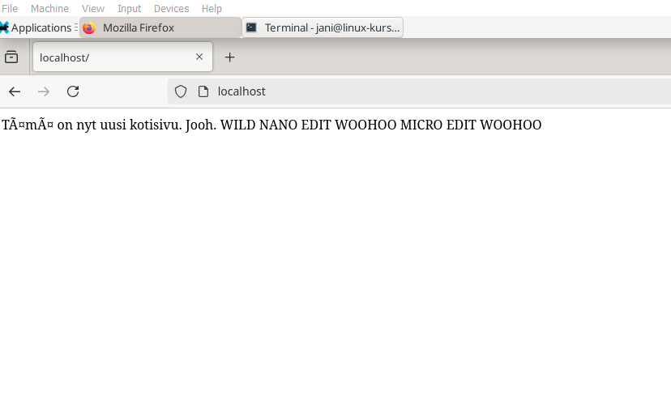
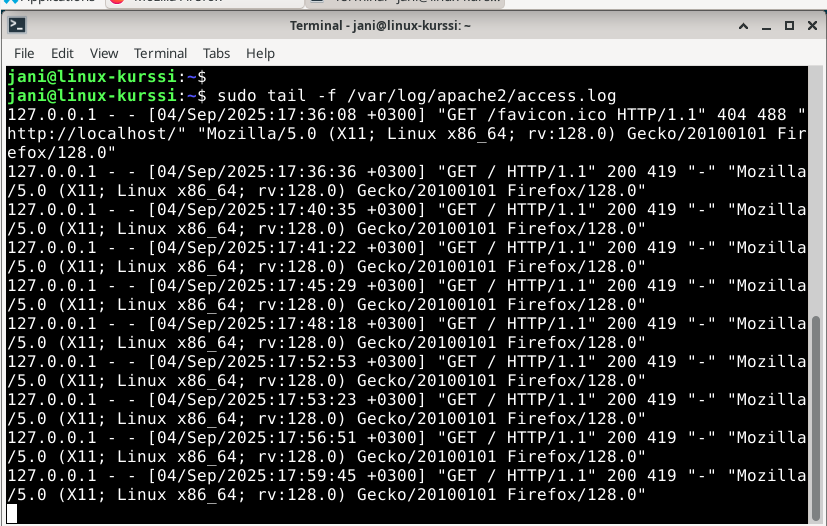
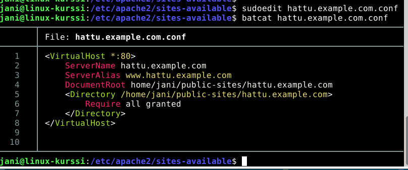
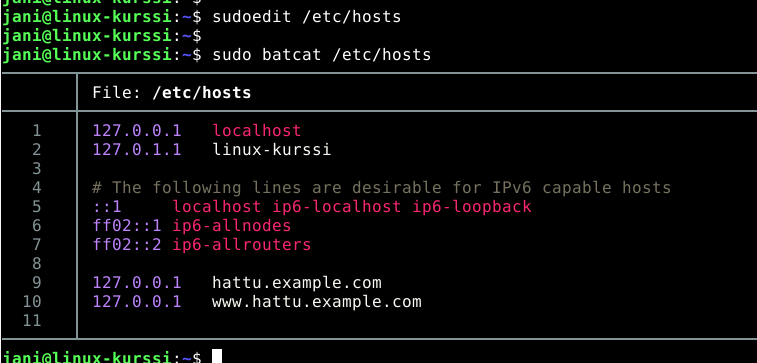
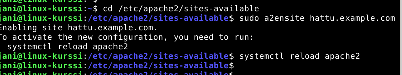
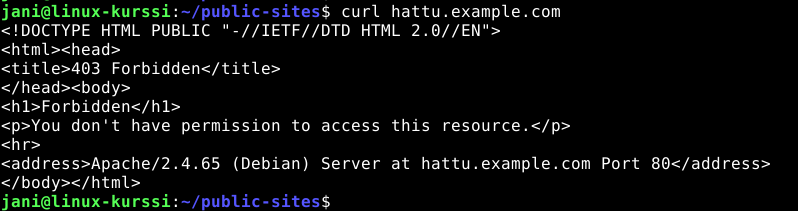
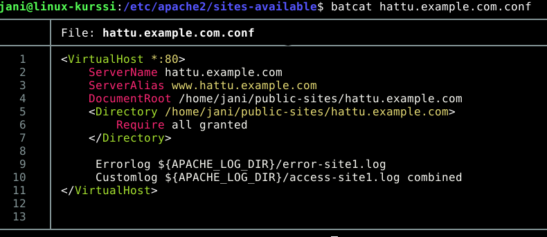
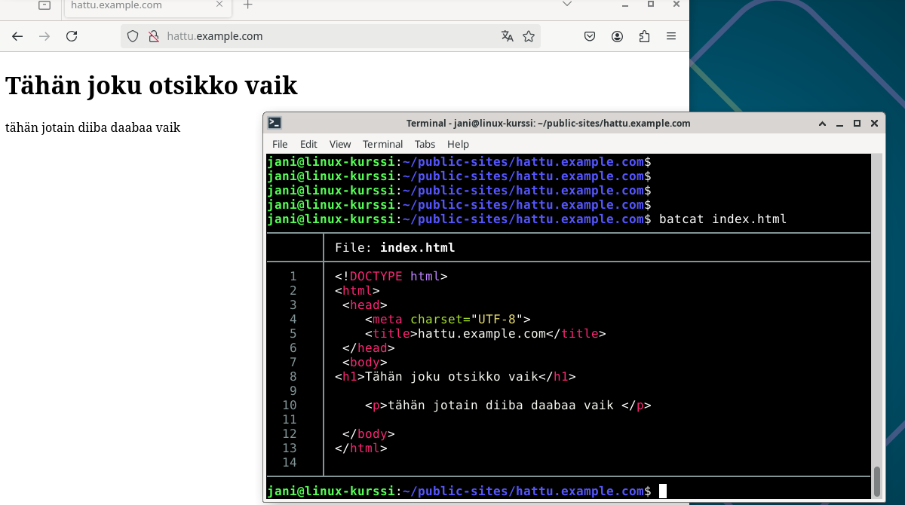
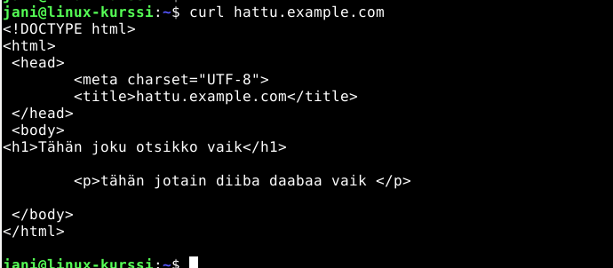
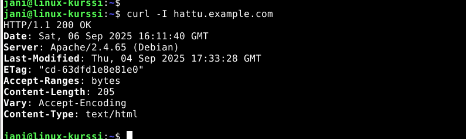

# h3 - Hello Web Server

## Tiivistelmät 

*3.9.2025*
### Apache.org: Name-based Virtual Host Support - tiivistelmä[^1]

- Name Based Virtual Hostingin avulla useampi verkkosivu voi jakaa saman IP-osoitteen, mikä ei ole mahdollista IP-pohjaisessa virtuaalipalvelimessa.
- Nimipohjaisessa virtuaalipalvelimessa jokainen verkkotunnus (hostname) yhdistyy nimipalvelimeen (DNS), jonka jälkeen Apachen HTTP-palvelin määritellään tunnistamaan eri tunnusten nimet.
- Säästää IP-osoitteita IP-pohjaiseen virtuaalipalvelimeen verrattuna.

### Tero Karvinen: Name Based Virtual Hosts on Apache - tiivistelmä[^2]

Tero Karvisen artikkeli sisältää ohjeistuksen: 

- Apachen lataamiseen ja palvelimen oletussivuston vaihtamiseen
- Uuden osoitteen lisäämisestä nimipohjaisen palvelimeen 
- Uuden nettisivun luontiin normaalikäyttäjänä
- Useamman sivun toimivuuden testaamista varten

## Harjoitus

*4.9.2025*

Käytin näissä harjoituksissa yllä tiivistettyjä artikkeleita ja Johanna Heinosen tunnilla käyttämää opetusmateriaalia[^3] tiedon hakuun.

### a) Localhost

**17:17** käynnistin Linuxin virtuaalikoneessa.
**17:20** avasin localhost-sivun Firefox-selaimessa. Sivulle avautui tunnilla tekemäni vaatimaton html-tiedosto, jolla olin korvannut alkuperäisen oletussivun.

  

Alkuperäinen localhost sivu on tallennettuna index.html.orig-tiedostossa: 

### b) Lokien analysointi

**17:40** avasin sivun uudelleen ja vilkaisin lokeja komennolla: 

        sudo tail -f /var/log/apache2/access.log

Selvittelin googlailemalla[^4] lokin sisältöä ja sen tarkoitusta.

Lokit sisältää:
- IP-osoitteen, mistä pyyntö on lähetetty
- Kirjausten ajankohdan (päivämäärä, kellonaika, aikavyöhyke)
- Sivun käyttämän metodin ("GET / HTTP/1.1") 
- HTTP:n tilakoodin ("200")
- Palautettavan tiedoston koko ("236")
- Selaimen ja käyttöjärjestelmän yksityiskohtia

### c) Uusi etusivu

**18:25** aloitin uuden nimipohjaisen virtuaalipalvelimen luonnin. Käytin tähän Tero Karvisen ohjeistusta.

**18:30** tein apachen konfigurointi-hakemistoon ("/etc/apache2/sites-available/") tarvittavan tiedoston sivuston konfigurointia varten. 

**18:45** poistin tunnilla tekemäni konfigurointi-tiedoston.

**18:50** kävin muokkaamassa etc-hakemiston hosts-tiedostoa, johon lisäsin hattu.example.com-osoitteelle Localhostin IP-osoitteen.

**19:00** lisäsin hattu.example.com sites-enabled -hakemistoon komennolla

      sudo a2ensite hattu.example.com

Tämän jälkeen apache piti käynnistää uudelleen. 

**19:12** kokeilin luomani sivuston sisältöä curl-komennolla

        curl hattu.example.com

Tuloksena sain virheilmoituksen kielletystä sisäänpääsystä:

Kävin katsomassa luomaani konfiguraatiotiedostoa sivulle, ja siellä oli pieni kirjoitusvirhe: "/" puuttui hakemistopolun edestä. Korjasin sen ja lisäsin tuntimateriaalista pari lisäriviä konfiguraatioon. 

Tämä ei kuitenkaan edelleenkään ratkaissut ongelmaa.

N. **19:30** katsoin tarkemmin hakemistojen käyttötietoja ja huomasin, että public-sites on jostain syystä juurikäyttäjän hallitsemana itseni sijasta: 

Päätin poistaa kyseisen hakemiston ja luoda sen uudelleen, jonka päälle lisäsin sivustolle vielä oman hakemiston, jossa index.html tiedosto sijaitsee. 
Tämän avulla curl toimi, mutta tunnilla tekemäni kotisivu näkyi edelleen, kun yritin mennä osoitteeseen hattu.example.com. 

**20:15** sain jotain selvyyttä ongelmaan, kun huomasin poistaneeni var/www/html -hakemistosta index.html -tiedoston, mikä luonnollisesti aiheutti ongelmia. Tämän jälkeen public-sites -hakemistossa oleva index.html toimi osoitteessa odotetusti. 

### d) HTML-kotisivu

**20:25** rupesin muokkaamaan index.html:stä validia HTML-sivua. 
**20:35** olin saanut valmiiksi vaatimattoman sivuston, otsikolla ja tekstikappaleella.

Tässä kohtaa päätin lopettaa ja jatkaa harjoitusta myöhemmin.

*6.9.2025*
### e) Curl-komento

Esimerkit curl-komennoista: 

**Yksinkertainen curl-komento**

    curl hattu.example.com

- Tekee HTTP GET -pyynnön komentoon annetulle sivulle
- Siirtää ja tulostaa sivun HTML-koodin komentoriville

**Curl -I -komento**

    curl -I hattu example.com

- Hakee ja tulosta HTML-koodin sijaan vain sivun otsakkeet
- Otsakkeet sisältävät tietoa sivun tilasta ja vastauksesta pyyntöön.

  

  Selvitin Mozillan Web Docs -kirjastosta otsakkeiden merkityksiä.[^5]
  Otsakkeissa näkyy esimerkiksi:
  - HTTP:n tilakoodi
  - **Date**: HTTP-pyynnön ajankohta
  - **Server**: Sivua ylläpitävä palvelin
  - **Last-Modified**: Milloin tiedostoa on viimeksi muokattu.
  - **Accept-Ranges**: Hyväksyykö palvelin tiedoston osittaisia pyyntöjä
  - **Content-Length**: Vastauksen sisällön koko tavuissa.
  - **Content-Type**: Sivun sisällön datatyyppi.
 
Harjoitus valmis.

#### Lähteet

Käytin harjoituksessa ja tiivistelmissä seuraavia tietolähteitä: 

[^1]: Apache. Name Based Virtual Host Support. Internet-dokumentaatio. https://httpd.apache.org/docs/2.4/vhosts/name-based.html
[^2]: Karvinen, Tero: 2018-04-10. Name Based Virtual Hosts on Apache – Multiple Websites to Single IP Address. Kurssin opetusmateriaali. https://terokarvinen.com/2018/04/10/name-based-virtual-hosts-on-apache-multiple-websites-to-single-ip-address/
[^3]: Heinonen, Johanna: 2025-09-03. Apache2. Kurssin opetusmateriaali. https://github.com/johannaheinonen/johanna-test-repo/blob/main/linux-03092025.md
[^4]: Girvin, David: 2025-2-20: Understanding the Apache access log: how to view, locate, and analyze. Blogiartikkeli. https://www.sumologic.com/blog/apache-access-log
[^5]: MDN Web Docs - Mozilla. HTTP Headers. Internet-dokumentaatio. https://developer.mozilla.org/en-US/docs/Web/HTTP/Reference/Headers
