# h6 - Salataampa

*26.9.2025*
## x) Tiivistelmät

**Tehtävänanto**: Lue ja tiivistä.[^1]

### Let's Encrypt - How It Works?[^2]

  - **ACME**-protokolla = **A**utomatic **C**ertification **M**anagement **E**nvironment
  - Let's Encryptin tavoitteena mahdollistaa automaattinen SSL-sertifikaattien hankinta ACME-protokollaa hyödyntämällä

  #### Vaiheet
    
  1. ACME-protokollan client varmentaa CA:lle (Certificate Authority) web-palvelimen hallitsevan tiettyä verkkotunnusta
  2. ACME-client pystyy tämän jälkeen pyytämään ja kumoamaan sertifikaatteja tälle verkkotunnukselle
  3. Sertifikaatin myöntämisen jälkeen se toimitetaan myös Certain Transparency[^3]-lokeihin. 

### SSL/TLS Strong Encryption: How-To[^4]

  Tämä dokumention osio näyttää SSL-konfiguraatiotiedoston vähittäisvaatimukset: 

  - Portti: 443
  - VirtualHost-osion sisällä: 
    - ServerName (verkko-osoite)
    - SSLEngine päällä
    - SSL-sertifikaatin ja avaimen hakemistopolku
   
## a) Let's

**Tehtävänanto**: Hanki ja asenna palvelimellesi ilmainen TLS-sertifikaatti Let's Encryptilta. Osoita, että se toimii.[^1]

**20:40**: Aloitin tehtävän avaamalla Linuxin Virtualboxissa. Avasin komentorivin ja kirjauduin SSH-yhteydellä vuokraamalleni virtuaalipalvelimelle.

**20:44**: Rupesin alustamaan sertifikaatin hankintaa varmistamalla, että sivustoni toimii ja on näkyvillä julkisesti. Testasin tätä curl ja host-komennoilla: 

```curl janikave.com```
```host janikave.com```

Tein tämän myös hankkimilleni alidomainilleni (www ja info). Kuvassa info-sivun curl ja host -komennot:

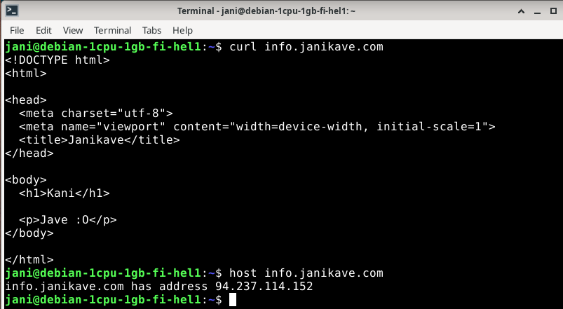

Katsoin myös sivun toimintaa Linuxissa ja Windowsilla Firefox ja Chrome-selaimilla, sekä kännykälläni Safari-selaimella. Sivu toimi joka kerta odotetusti.

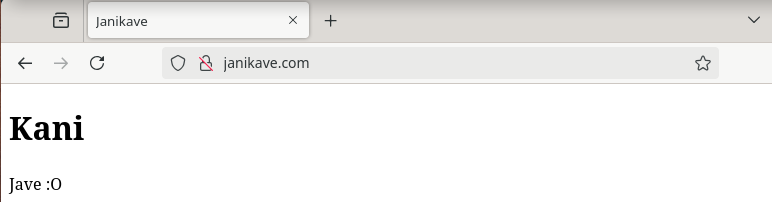

**20:55**: Uudelleenkäynnistin Apachen ja varmistin sen olevan käynnissä komennoilla: 

```sudo systemctl restart apache2```
```systemctl status apache2```

**21:00**: Lisäsin reiän palomuuriin 443-portille ja varmistin, että myös portilla 80 on pääsy: 

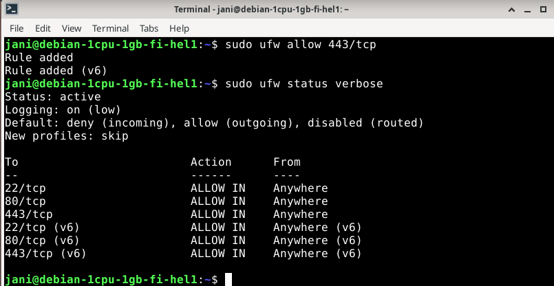

**21:08**: Latasin tehtävänannon[^1] vinkeissä annetun version certbotista virtuaalipalvelimelleni. 

```sudo apt-get install certbot python3-certbot-apache```

Ladattuani certbotin luin hieman komennon toiminnasta man[^5] ja tldr[^6]-komennoilla. 

Tämän jälkeen ajoin certbot-komennon sivuni osoitteelle: 

```sudo certbot --apache --domains janikave.com,www.janikave.com```

Jätin pyydetyn email-kohdan tyhjäksi ja hyväksyin rekisteröinnin ACME:n palvelimelle. Nämä tehtyäni certbot otti onnistuneesti käyttöön sertifikaatin antamilleni tietueille. 

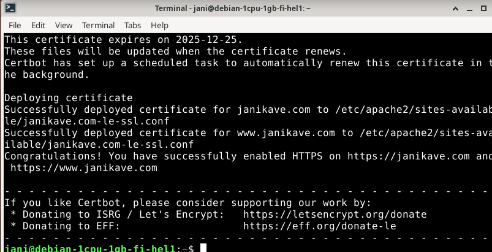

Tämän jälkeen uudelleenkäynnistin apachen ja testasin sivujen toimivuutta curlilla, joka antoi lupaavia merkkejä: 

![Add file: Upload]

Tämän jälkeen menin itse sivuille ja lukkokuvakkeen punainen viiva oli hävinnyt sertifikaatin myöntämisen johdosta: 

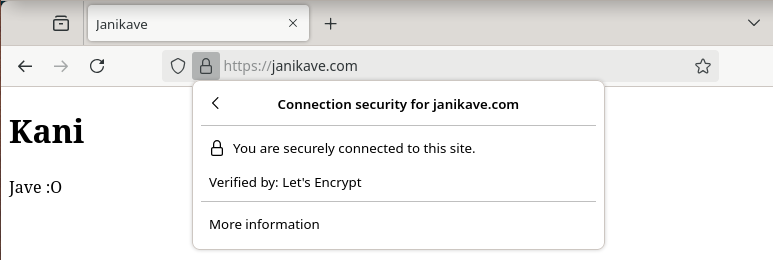

### Sertifikaatti alidomainille

**21:25**: Olin saanut osoitteelleni siis SSL-sertifikaatin, mutta info-alidomainillani tätä ei vielä ollut: 

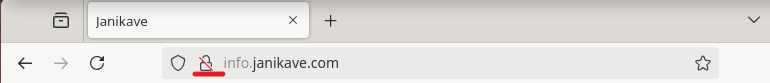

Päätin sitten tehdä myös tälle osoittelle oman nimipohjaisen virtuaalipalvelimen: 

- Loin info.janikave.com.conf-tiedoston /etc/apache2/sites-available-hakemistoon
- Loin uuden info.janikave.com-hakemiston käyttäjäni public-sites -hakemistoon

``` mkdir -p /home/jani/public-sites/info.janikave.com```

- Kopioin index.html-tiedoston uuteen hakemistoon ja varmistin sen onnistuneen

``` cp /home/jani/public-sites/janikave.com/index.html /home/jani/public-sites/info.janikave.com/```

```ls -l /home/jani/public-sites/info.janikave.com/```

- Lisäsin sivuston sites-enabled hakemistoon ja käynnistin Apachen uudelleen

```sudo a2ensite info.janikave.com```

```sudo systemctl restart apache2```

- Muokkasin sivua hieman erilaiseksi aiemmasta sivustani, jotta voisin testata sen toimivuutta.

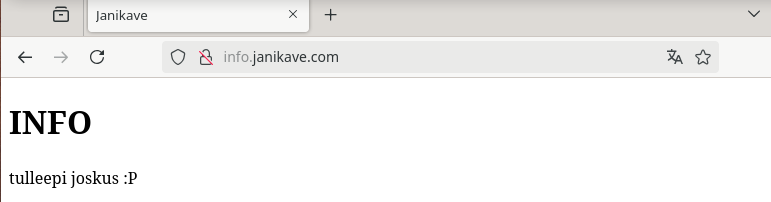

**21:50**: Koska nimipohjainen virtuaalipalvelin tuntui toimivan halutusti, yritin myös lisätä alidomainilleni SSL-sertifikaattia certbotilla: 

```sudo certbot --apache -d info.janikave.com``` 

Komento toimi halutusti!

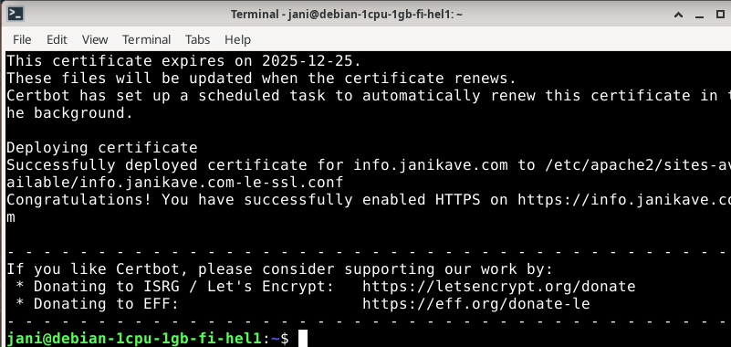

Apachen uudelleenkäynnistyksen jälken vielä kokeilin sivua curl-komennolla ja selaimessa: 

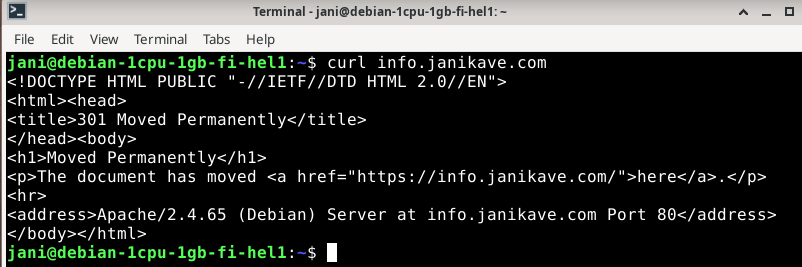

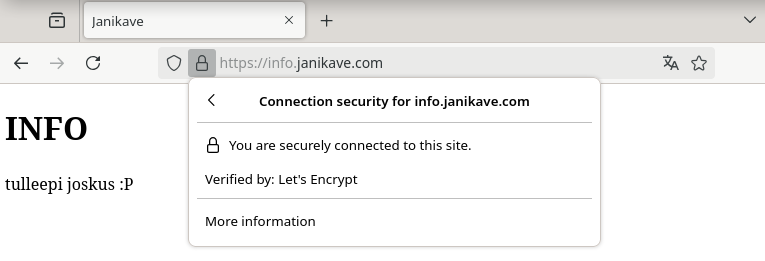 

**22:00**: Sain tämän osion valmiiksi.

*Tähän osioon käytetty aika*: **20:40-22:00**

## b) A-rating

*27.9.2025* 

**Tehtävänanto**:  A-rating. Testaa oma sivusi TLS jollain yleisellä laadunvarmistustyökalulla, esim. SSLLabs.[^1]

**18:55**: Avasin SSLLabsin sivun[^7] ja syötin sinne ensiksi sivuni janikave.com. 

SSL Labs arvioi sivua n. reilun minuutin verran, kunnes se palautti arvionsa sivusta: 

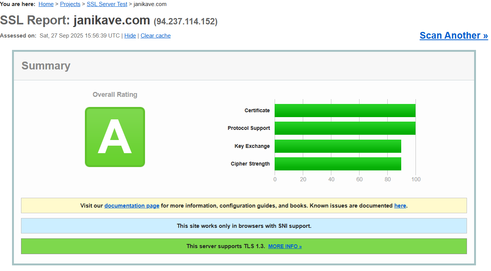

Tein myös saman toiselle sivulleni info.janikave.com: 

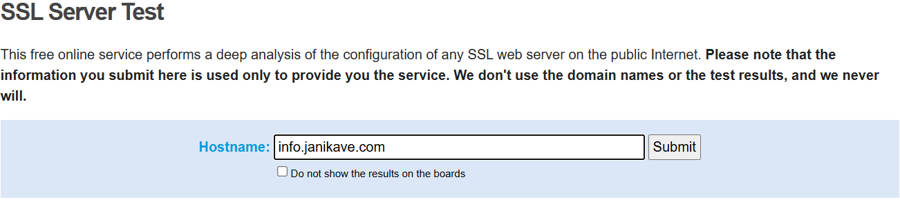 

Molempien sivujen saamat arviot olivat identtisiä: 

- **Certificate** ja **Protocol Support** saivat arvioksi 100/100.
- **Key Exchange** ja **Cipher Strength** saivat arvioksi 80/100.

**19:10**: Päätin tarkemmin katsella arviota, selvittääkseni miksi kaksi osioita eivät saaneet täysiä pisteitä. 

Eniten silmään pisti arvion kohta **Handshake Simulation**, missä Safarin vanhemmat versiot (Safari 8:sta alaspäin) sekä Chromen vanha versio 49 olivat selaimia, joissa "kättely" oli epäonnistunut. Kuvassa Safarin kaikki versiot arviosta: 

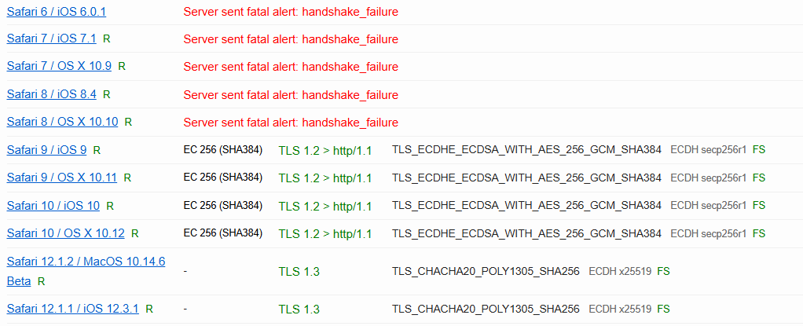

Lueskelin vielä tarkemmin arvioiden laskentaperusteita SSL Server Rating Guide-dokumenttia[^8] SSL Labsin Githubista, jonka jälkeen totesin arvion olevan itselleni riittävä toistaiseksi. 

**19:45**: Sain tämä osion valmiiksi.

*Tähän osioon käytetty aika*: **18:55-19:45**

## Yhteenveto 

Tähän asti saaduista tehtävistä tämä sujui vähimmällä päänsäryllä, oletettavasti harjoituksen suhteellisen yksinkertaisuuden ja tunnilla näytetyn hyvän esimerkin johdosta. Aika tyydyttävä fiilis kun näki lukko-ikonin oman sivun vieressä. Tiivistelmien tekeminen auttoi ymmärtämään aihealuetta hieman paremmin.

## Lähteet: 

Käytin tässä harjoituksessa seuraavia lähteitä

[^1]: Karvinen, Tero: 2025-09-24. h6 Salataampa. Luettavissa: https://terokarvinen.com/linux-palvelimet/#h6-salataampa
[^2]: Let's Encrypt: 2025-08-02. How It Works. Luettavissa: https://letsencrypt.org/how-it-works/
[^3]: Certificate Transparency. How CT fits into the wider Web PKI ecosystem. Luettavissa: https://certificate.transparency.dev/howctworks/
[^4]: Apache. SSL/TLS Strong Encryption: How-To: Basic Configuration Example. Luettavissa: https://httpd.apache.org/docs/2.4/ssl/ssl_howto.html#configexample
[^5]: Linux Command Library. Certbot - Obtain and install TLS/SSL certificates automatically. Luettavissa: https://linuxcommandlibrary.com/man/certbot
[^6]: Dendron - TLDR: 2024-12-19. Certbot. Luettavissa: https://tldr.dendron.so/notes/linux.certbot.html
[^7]: SSL Labs. SSL Server Test. Luettavissa: https://www.ssllabs.com/ssltest/index.html
[^8]: SSL Labs: 2025-05-17. SSL Server Rating Guide. GitHub-dokumentti. Luettavissa: https://github.com/ssllabs/research/wiki/SSL-Server-Rating-Guide

