# h7 - Maalisuora

*1.10.2025*
## a) Hei Maailma

**Tehtävänanto**: Kirjoita ja aja "Hei maailma" kolmella kielellä[^1].

**20:30** Aloitin harjoituksen heti oppitunnin päätyttyä, joten minulla oli jo Linux ja komentokehote auki. 

Rupesin Johanna Heinosen oppimateriaalia hyödyntäen[^2] luomaan shellscript-tiedostoja. Ensiksi poistin tunnilla luomani esimerkkitiedoston helloworld.sh komennolla

```rm helloworld.sh```

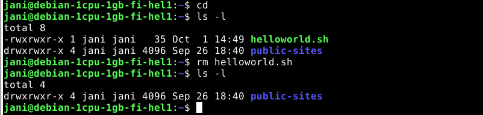

<del>Tämän jälkeen rupesin luomaan uutta tiedostoa micro-editorilla: 

```micro helloworld.fi.sh```

Editorissa lisäsin Heinosen ohjeen[^2] mukaisesti ensimmäiselle riville, mitä tulkkia käytetään: 

```#!/bin/bash``` -> tiedosto käyttää bash-tulkkia

Sitten lisäsin scriptiin sisällön, eli tässä tapauksessa palautettavan suomen kielisen Hello Worldin: 

```echo "Hei, maailma!"```

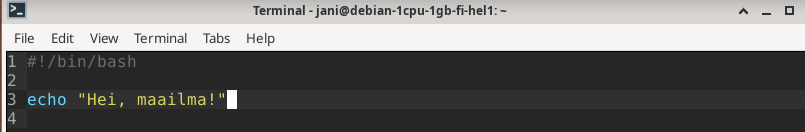

Tämän jälkeen katsoin ```ls -l``` komennolla tiedoston käyttöoikeudet, ja x-oikeudet puuttuivat. Lisäsin tiedoston suorittamista varten oikeudet komennolla:

```chmod a+x helloworld.fi.sh```

Tämä antoi x-oikedet joka käyttäjäryhmälle (user, groups, others).

Kokeilin scriptin ajamista yksinkertaisesti komennolla:

```./helloworld.fi.sh```

Tuloksena scripti palautti halutusti suomenkielisen "Hello, World!"-viestin. 

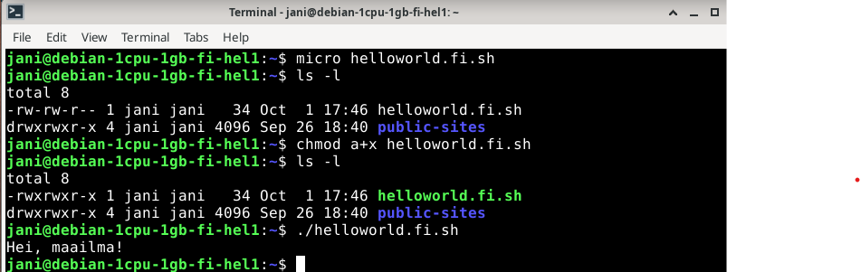

**20:50**: Tämän jälkeen tein samalla kaavalla helloworld.ee.sh ja helloworld.se.sh -nimiset scriptit, jotka palauttaisivat ajettaessa tervehdykset: 

Viroksi 

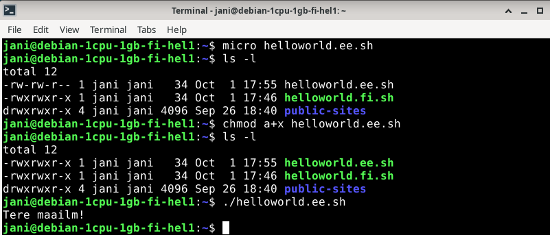

Ruotsiksi

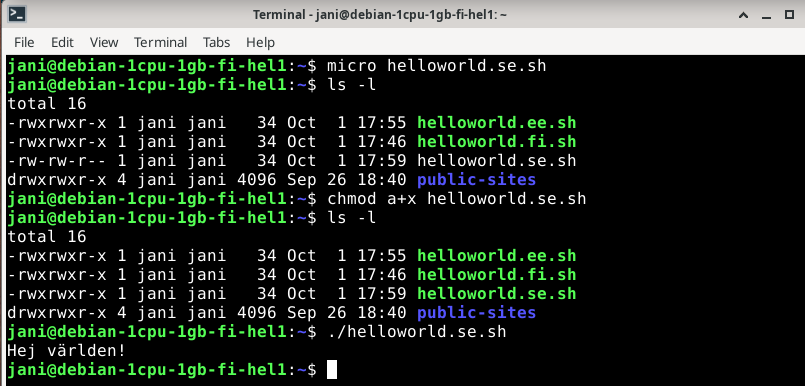

**21:05**: Sain tämän osion valmiiksi. </del>

*6.10.2025* **EDIT**: No nyt vasta tajusin, että ne piti tehä **koodi**kielillä eikä millään peruskielillä ja pelkästään bashilla. Noh, tästä jatkuu:
 
**22:45**: Avasin Linuxin. Latasin tehtävänannon ohjeen[^1] mukaisesti rubyn perinteisen bashin ja jo tunnilla lataamani pythonin seuraksi: 

```sudo apt-get install ruby```

**22:55**: Tein ensiksi bashilla yksinkertaisen helloworld tiedoston, tehtävästä jo saamillani opeilla. Tämän jälkeen testasin sitä Karvisen ohjeen mukaan[^6]:

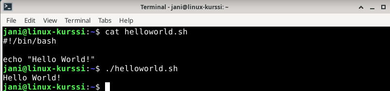

**23:05**: Tein pythonilla helloworld.py -scriptin ja lisäsin sille suoritusoikeudet. Testasin cat-komennolla ja ajamalla scriptin: 

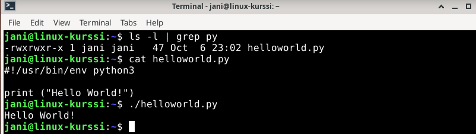 

**23:15**: Loin rubylla helloworld.rb -scriptin ja päivitin suoritusoikeudet. Testasin samalla tavalla kuin aiemmatkin scriptit:

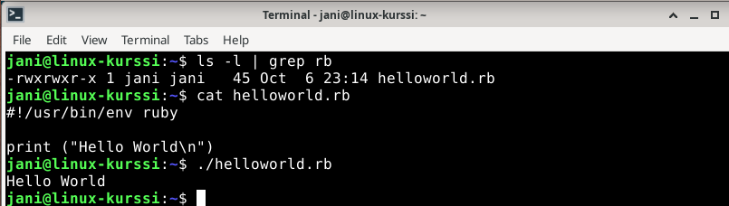

*Tähän osaan käytetty aika (1.10.2025*):  **20:30-21:05**
*Tähän osaan käytetty aika (6.10.2025*):  **22:45-23:15**

## b) Lähdeviitteet

**Tehtävänanto**: Lähdeviitteet. Tarkista ja tarvittaessa lisää lähdeviitteet kaikkiin raportteihisi h1 alkaen.

Kävin korjaamassa aiempien raporttien lähdeviittaukset yhteneväisiksi ja lisäsin puuttuvat viittaukset sekä tehtävänannot. 

## c) Uusi ajettava komento 

**Tehtävänanto**:  Laita Linuxiin uusi, itse tekemäsi komento niin, että kaikki käyttäjät voivat ajaa sitä.[^2]

**21:10**: Lueskelin lisää kurssin opetusmateriaalia[^2] keksiäkseni jonkinlaisen ajettavan scriptin.  

**21:20**: Päätin tehdä tiedonsyöttöä ja if-lauseketta hyödyntävän scriptin usr/local/bin-hakemistoon

``` micro /usr/local/bin/helloname.sh```

**21:35**: Olin saanut tälläisen alustavan scriptin luotua: 

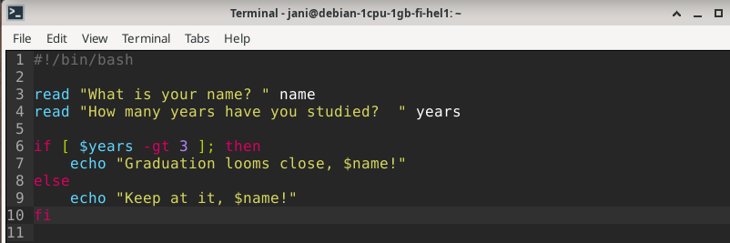

Päätin kokeilla sitä heti, jolloin sain palautukseksi estetyn pääsyn: 

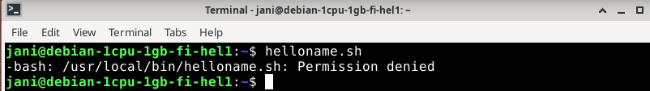

Menin kansioon, jossa tiedosto sijaitsee ja katsoin käyttöoikeudet. X-oikeudet puuttuivat kokonaan, joten päätin muokata niitä: 

``` sudo chmod a+x helloname.sh``` 

Käytin sudo-oikeuksia, koska tiedosto ei sijaitse kotihakemistossani ja ilman niitä komento ei mennyt läpi. 

Kokeilin scriptin ajoa, mutta sain vastaani virheilmoituksen: 

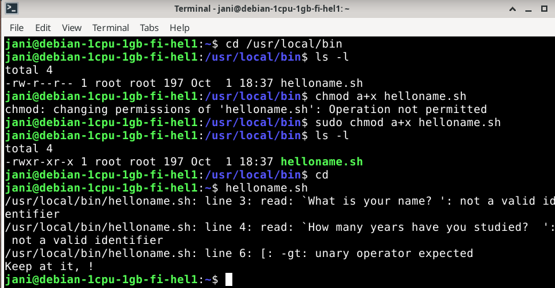

Katsoin tarkemmin opetusmateriaalia[^2] ja muokkasin tiedostoa hieman lisäämällä ```-p``` read-komentojen perään: 

 

Vaihdoin myös if-lausekkeen ehdon arvoa hieman. Tämän jälkeen script toimi halutulla tavalla: 

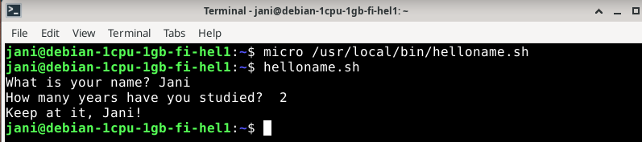 

**22:00**: Sain tämän osion valmiiksi. 

*Tähän osioon käytetty aika*: **21:10-22:00**

## d) Labraharjoitus

*6.10.2025* 

**Tehtävänanto**: Ratkaise vanha arvioitava laboratorioharjoitus soveltuvin osin.[^1]

**Laboratorioharjoitus**: [h7 - Vanha laboratorioharjoitus](https://github.com/janikave/linux-palvelimet/blob/main/h7/h7_labra.md)[^2][^3][^4][^5]

## Yhteenveto

Ensimmäiset tehtävät meni aika mutkitta heti oppitunnin jälkeen. Kerkesin tehdä labraharjoituksen vasta nyt maanantaina, viikonloppu meni mökkeillessä.
Labraharjoituksen kanssa meni pidempään, aika hyvää kertausta koko kurssin opeista. Paljon tuli muistettua, mutta jotain juttuja piti vilkaista opetusmateriaaleista.

**Lisäys**: Jouduin tekemään ensimmäisen osan uudestaan, kun tajusin ymmärtäneeni tehtävänannon täysin väärin. Onneksi tähän ei kulkenut liikaa aikaa, kun virheellisestikin tehty osakin opetti hyvin ja uusien scriptien luonti sujui mutkitta. 


## Lähteet


[^1]: Karvinen, Tero. h7 Maalisuora, kurssimateriaali. Luettavissa: https://terokarvinen.com/linux-palvelimet/#h7-maalisuora
[^2]: Heinonen, Johanna: 2025-10-01. Linux Shell Scripting Basics. Luettavissa: https://github.com/johannaheinonen/johanna-test-repo/blob/main/linux-01102025.md
[^3]: Karvinen, Tero: 2024-03-12. Final Lab for Linux Palvelimet 2024 Spring. Luettavissa: https://terokarvinen.com/2024/arvioitava-laboratorioharjoitus-2024-linux-palvelimet/
[^4]: Heinonen, Johanna: 2025-08-27. Linux Commands. Kurssin opetusmateriaali. Luettavissa: https://github.com/johannaheinonen/johanna-test-repo/blob/main/linux-27082925.md
[^5]: Karvinen, Tero: 2017-09-19. First Steps on a New Virtual Private Server – an Example on DigitalOcean and Ubuntu 16.04 LTS. Kurssin opetusmateriaali. Luettavissa: https://terokarvinen.com/2017/first-steps-on-a-new-virtual-private-server-an-example-on-digitalocean/
[^6]: Karvinen, Tero: 2018-09-17. Hello World Python3, Bash, C, C++, Go, Lua, Ruby, Java – Programming Languages on Ubuntu 18.04. Kurssin opetusmateriaali. Luettavissa: https://terokarvinen.com/2018/hello-python3-bash-c-c-go-lua-ruby-java-programming-languages-on-ubuntu-18-04/
